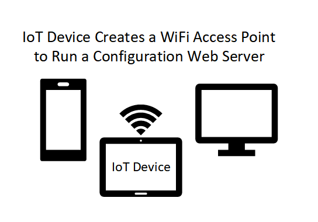
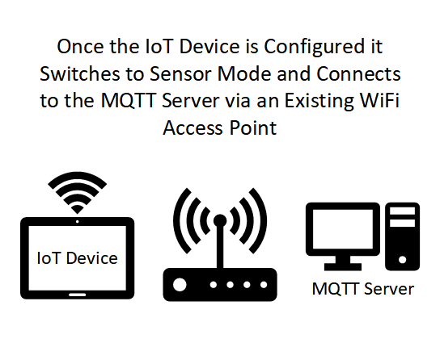
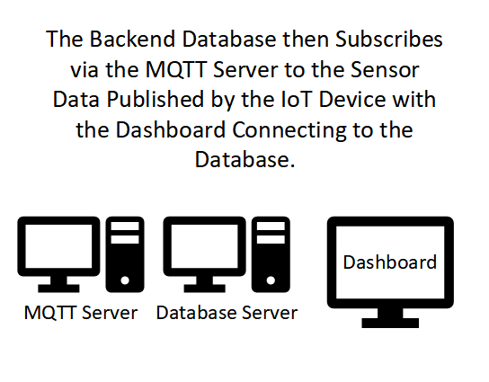

# Home Sensor Network

## About

This repository contains code and instructions to setup a simple home sensor network using [ESP82866](https://github.com/esp8266/Arduino) modules with the [Arduino IDE](https://www.arduino.cc/en/software) connected via an MQTT network backed by [Mosquito](https://mosquitto.org/), [Telegraf](https://www.influxdata.com/time-series-platform/telegraf/), [InfluxDB](https://www.influxdata.com/products/influxdb/) and [Grafana](https://grafana.com/).

## Architecture

Initially the IoT device is not configured.

After being configured the IoT device start publishing to the MQTT server.

Finally the backend services via the MQTT server subscribe to the sensor data published by the IoT device allowing dashboards and more to be created.

## Tutorial

### [Step 1 - Configuring Sensors](docs/step_1/index.md) [TODO]

### [Step 2 - Configuring Backend Services](docs/step_2/index.md) [TODO]

### [Step 3 - Customizing Dashboards and Monitoring](docs/step_3/index.md) [TODO]

### [Step 4 - Securing Services](docs/step_4/index.md) [TODO]

### [Step 5 - Triggering Actions](docs/step_5/index.md) [TODO]

### [Step 6 - Custom Enclosures](docs/step_6/index.md) [TODO]

### [Step 7 - Next Steps](docs/step_7/index.md) [TODO]
