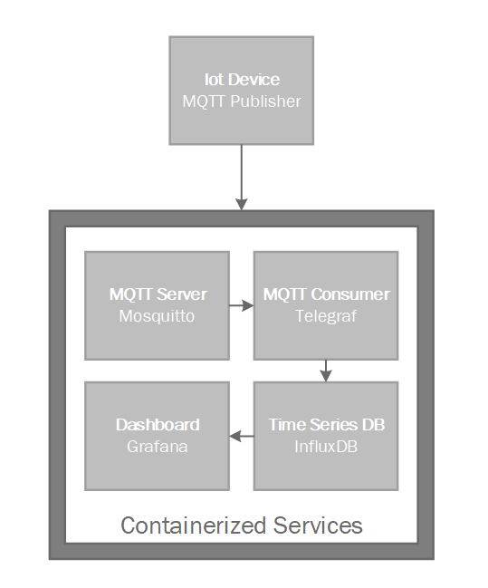
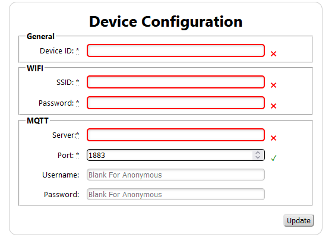

# Configuring Backend Services

## Overview

The follow illustrates the overview of the backend services:



There are number of ways to orchestrate the backend services but for the purposes of this tutorial we will use Docker Compose.

## Docker Compose

The following [docker-compose.yaml](../../docker/docker-compose.yml) sets up the backend services.

```yaml
version: "3.9"
services:
  mqtt_server:
    image: eclipse-mosquitto:latest
    volumes:
      - "./mosquitto.conf:/mosquitto/config/mosquitto.conf"
    expose:
      - "1883"
      - "9001"
    ports:
      - "0.0.0.0:1883:1883"
  database:
    image: influxdb:latest
    environment: 
      DOCKER_INFLUXDB_INIT_MODE: setup
      DOCKER_INFLUXDB_INIT_USERNAME: iot_user
      DOCKER_INFLUXDB_INIT_PASSWORD: change_me
      DOCKER_INFLUXDB_INIT_ORG: iot
      DOCKER_INFLUXDB_INIT_BUCKET: data
      DOCKER_INFLUXDB_INIT_RETENTION: 1w      
      DOCKER_INFLUXDB_INIT_ADMIN_TOKEN: jK3BLJUWgUw7iBzkHlMCDaPcrccalB0yIAGapbgZgyz8mGDHHdbatGVdfOtiKtefh9yDw_D0KcpKM2cFiwEvQA==
    volumes:
      - influx_data:/var/lib/influxdb2
      - influx_config:/etc/influxdb2
    expose: 
      - "8086"
    ports:
      - "8086:8086"
  mqtt_consumer:
    image: telegraf:latest
    depends_on: 
      - mqtt_server
      - database
    volumes:
      - "./telegraf.conf:/etc/telegraf/telegraf.conf"
  dashboard:
      image: grafana/grafana:latest
      environment: 
        GF_SECURITY_ADMIN_USER: iot_user
        GF_SECURITY_ADMIN_PASSWORD: change_me
      depends_on: 
        - database
      volumes:
      expose:
        - "3000"
      ports:
        - "3000:3000"
      volumes:
        - grafana_data:/var/lib/grafana
        - "./datasources.yaml:/etc/grafana/provisioning/datasources/datasources.yaml"     
volumes:
  influx_data:
  influx_config:
  grafana_data:
```

A couple of notes:

* The username/password are propagated throughout literally, for production they should be protected and managed centrally.
* There are a number of interconnected configuration files that should use variables rather than literal values.
* Services are connected without using SSL which is not a good production practice.
* The MQTT server does not perform any authentication, which again is not a good production practice.

## Mosquitto

The MQTT server, [Mosquitto](https://mosquitto.org/), is configured with [mosquitto.conf](../../docker/mosquitto.conf):

```
listener 1883
allow_anonymous true
```

This is a simple configuration file that configures the server to listen to port 1883 on all network interfaces ``listener 1883`` and allows for anonymous access with ``allow_anonymous true``

## InfluxDB

For the time series database to store the sensor data, [InfluxDB](https://www.influxdata.com/products/influxdb/) is used. The database is setup with the use of the following environment variables:

```yaml
environment: 
    DOCKER_INFLUXDB_INIT_MODE: setup
    DOCKER_INFLUXDB_INIT_USERNAME: iot_user
    DOCKER_INFLUXDB_INIT_PASSWORD: change_me
    DOCKER_INFLUXDB_INIT_ORG: iot
    DOCKER_INFLUXDB_INIT_BUCKET: data
    DOCKER_INFLUXDB_INIT_RETENTION: 1w      
    DOCKER_INFLUXDB_INIT_ADMIN_TOKEN: jK3BLJUWgUw7iBzkHlMCDaPcrccalB0yIAGapbgZgyz8mGDHHdbatGVdfOtiKtefh9yDw_D0KcpKM2cFiwEvQA==
```

The key aspect to note is that the admin token needs to be explicitly set in order to allow for [Telegraf](https://www.influxdata.com/time-series-platform/telegraf/) and [Grafana](https://grafana.com/) to be able to connect automatically to the database.

## Telegraf

[Telegraf](https://www.influxdata.com/time-series-platform/telegraf/) is required to create a link between the MQTT server and [InfluxDB](https://www.influxdata.com/products/influxdb/). It is configured simply with [telegraf.conf](../../docker/telegraf.conf)

```toml
[agent]
  interval = "10s"
  round_interval = true
  metric_batch_size = 1000
  metric_buffer_limit = 10000
  collection_jitter = "0s"
  flush_interval = "10s"
  flush_jitter = "0s"
  precision = ""
  hostname = ""
  omit_hostname = false

  [[outputs.influxdb_v2]]
    urls = ["http://database:8086"]
    token = "jK3BLJUWgUw7iBzkHlMCDaPcrccalB0yIAGapbgZgyz8mGDHHdbatGVdfOtiKtefh9yDw_D0KcpKM2cFiwEvQA=="
    organization = "iot"
    bucket = "data"
  
  [[inputs.mqtt_consumer]]
    servers = ["tcp://mqtt_server:1883"]
    topics = ["sensors/#"]
    data_type = "float"
    data_format = "value"
```

The key to note is for the mqtt_consumer configuration the data_type and data_format need be set explicitly so Telegraf does not expect the published sensor data to be in the InfluxDB line protocol.

## Grafana

[Grafana](https://grafana.com/) is used to visualize the sensor data, it is automatically connected to the [InfluxDB](https://www.influxdata.com/products/influxdb/) with the use of data source provisioning with [datasources.yaml](../../docker/datasources.yaml) as follows:

```yaml
apiVersion: 1
datasources:
  - name: influxdb
    type: influxdb
    access: proxy
    url: http://database:8086/
    user: iot_user
    secureJsonData:
      token: jK3BLJUWgUw7iBzkHlMCDaPcrccalB0yIAGapbgZgyz8mGDHHdbatGVdfOtiKtefh9yDw_D0KcpKM2cFiwEvQA==
      password: change_me
    jsonData:
      version: Flux
      organization: iot
      defaultBucket: data
```

## Launching the Services

In order to launch the backend services, copy the contents of /docker locally and within the folder run:

```bash
docker-compose up
```

This will expose the MQTT server on port 1883 on the IP address of the computer running the services - take note of this ip and power up the IoT device with the uploaded sketch. This will cause the IoT device to create a WiFi access point with the network name of the generated device ID which should be IOT_XXXXXXXXXXXX - connect to this network and load the configuration page at http://192.168.4.1 (the IP might be different but it will be printed to the Serial output).



Select a meaningful Device ID, such as Bathroom, provide the WiFi connection details and use the IP address of the machine running the backend services for the MQTT Server.

After the IoT device resets, it should connect to the MQTT server resulting in the published sensor data being saved by the backend services.


## [Next Step: Customizing Dashboards and Monitoring](../step_3/index.md)
